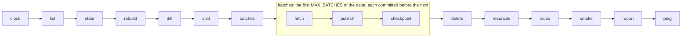

<p align="center">
  <a href="https://github.com/katoptra">
    <picture>
      <source media="(prefers-color-scheme: dark)" srcset="https://katoptra.org/brand/katoptra-mark-dark-224.png">
      
    </picture>
  </a>
</p>

<h1 align="center">nongnu</h1>

<p align="center">A twice-daily mirror of Savannah's nongnu release tree.</p>

<p align="center">
  <a href="https://github.com/katoptra/nongnu/actions/workflows/sync.yml"></a>
  <a href="LICENSE"></a>
  <a href="https://github.com/katoptra/nongnu/actions/workflows/sync.yml"></a>
</p>

A mirror of `https://download.savannah.nongnu.org/releases/`, the release files of the
non-GNU projects Savannah hosts, on Cloudflare R2, served at `https://nongnu.katoptra.org/`.
Every path upstream serves is served here at the root: about 51,000 files and 80 GB, with
a page for every directory. Twice a day it lists Savannah's tree, moves only what changed,
and redraws the pages of the directories it touched.

## How to use

Swap the host in any release URL. `https://download.savannah.nongnu.org/releases/freetype/`
becomes:

```sh
curl -s https://nongnu.katoptra.org/freetype/
```

Signatures sit beside their files as upstream publishes them. Check one against the
project's own key with `gpg --verify <file>.sig <file>`.

Is it fresh? Savannah writes `00_TIME.txt` at the root, and the mirror copies it like any
other file:

```sh
curl -s https://nongnu.katoptra.org/00_TIME.txt
```

## How it works

Twice a day a GitHub Actions job runs this pipeline inside the toolbox image from
[katoptra/lib](https://github.com/katoptra/lib). Every box is a verb of lib's rsync engine;
this mirror adds none of its own.



What this mirror sets, in [`Taskfile.yml`](Taskfile.yml):

- **Its identity**: `SOURCE` (`rsync://dl.sv.gnu.org/releases/`, the module Savannah's
  mirror page names), `HOST`, `BUCKET`, a 120 GB `CEILING_GB` past which a run refuses to
  start, and a `LIST_FLOOR` under which a listing is taken as truncated rather than as a
  deletion list.
- **Directory pages.** `INDEX` turns on the engine's pages: one per directory, drawn from
  the state and served for `/dir/` and `/dir` alike. `PAGE_FOOT` is the line every page
  closes on: what the mirror is, how often it updates, and where to report a problem.
- **The canary.** `CANARY` is `00_MIRRORS.html`, whose 17 plain `http://` links any of
  Cloudflare's HTML rewriters would alter. After every run the engine reads it through the
  domain as a Perl client and compares it byte for byte with the bucket's copy.
- **Freshness.** `FRESH_KEY` is `00_TIME.txt`, where Savannah writes its clock. After every
  run the engine reads it through the domain and fails the run once it is a day old, before
  GNU's monitor calls the mirror old at 28 hours.

Everything else, from the list diff and the batching to the state file and the daily
reconcile, is documented once in [lib's README](https://github.com/katoptra/lib#the-rsync-engine).

## Want your own?

### 1. Fork it

Fork [katoptra/nongnu](https://github.com/katoptra/nongnu). `HOST`, `BUCKET` and the address
in `PAGE_FOOT` are yours to change. `SOURCE` stays: Savannah offers no secondary.

### 2. Storage

| What | Why |
|---|---|
| An R2 bucket, or any S3-compatible bucket | The tree, its pages and their state: about 80 GB, $1.21 a month on R2 |
| An API token with Object Read & Write, scoped to that bucket | The three `AWS_*` values in step 3 |
| A custom domain on the bucket, which is `HOST` | What clients and the read-back checks fetch from |

`aws.config` keeps every file under 4 GiB a single PutObject; the largest is 0.72 GB. How
the engine uses a bucket: [lib, Storage](https://github.com/katoptra/lib#storage).

### 3. Secrets

Four values, in one vault item named `nongnu`:

| Section | Field | What it is | Reaches the run as |
|---|---|---|---|
| `r2` | `access_key_id` | The token from step 2 | `AWS_ACCESS_KEY_ID` |
| `r2` | `secret_access_key` | Its secret | `AWS_SECRET_ACCESS_KEY` |
| `r2` | `endpoint` | `https://<account-id>.r2.cloudflarestorage.com` | `AWS_ENDPOINT_URL` |
| `healthcheck` | `url` | Optional: a healthchecks.io ping URL | `HEALTHCHECK_URL` |

Put your vault's UUID into the four references in [`op.env`](op.env), make a service
account that can read that vault, and store its token as the `OP_SERVICE_ACCOUNT_TOKEN`
secret. [lib, Secrets](https://github.com/katoptra/lib#secrets) has the details.

### 4. The zone

Three rules, each scoped to the mirror's hostname:

| Rule | What it does |
|---|---|
| Configuration Rule | Email Obfuscation, Rocket Loader, Automatic HTTPS Rewrites and Browser Integrity Check off. The first three rewrite HTML in flight, and the tree holds about 4,300 HTML files. The fourth answers 403 to Perl and Python clients. The canary fails if any comes back on |
| Cache Rule | Bypass. An edge copy would serve stale pages and a stale `00_TIME.txt` |
| Transform Rule | A path ending in `/` rewrites to `concat(http.request.uri.path, http.host, ".directory.index.html")`, the root included |

### 5. Prove it, run it, schedule it

On a laptop with go-task, the 1Password CLI and Docker or Apple `container`:

```sh
task check                # render every command of the pipeline inside the image; diff against render.txt
task run -- task list     # list upstream, no credentials; read .run/upstream.txt
```

Then Actions, sync, Run workflow. The first run finds an empty bucket, takes the whole
tree as the delta and works it four batches at a time, queueing the next run itself until
nothing is left: about 80 GB over five or six chained runs. Every run after that moves the
delta, usually a handful of files.

Nothing in this repository schedules a run. Add a `schedule:` trigger to
`.github/workflows/sync.yml` with a time of your own, or dispatch it from outside as this
mirror is. Whatever the time, a run also sweeps the bucket against the state once the last
sweep is 24 h old.

## Operating it

`task` alone prints the menu. A run takes its flags after the double dash, and the same
flags go in the workflow's `vars` input:

```sh
task sync                                   # one run, the same thing Actions runs
task sync -- RECONCILE=true                 # rebuild the state from the bucket and sweep orphans now
gh workflow run sync.yml -f vars='RECONCILE=true'
```

Every run appends one table to its job page: the delta and what landed, the state,
storage against the ceiling, and the directory pages drawn. A failed run is the only
alert: healthchecks.io emails when a slot passes without a ping, which also catches a
scheduler that stopped.

- **`split` refused the tree.** Upstream passed 120 GB. The mirror stays stale until
  `CEILING_GB` is raised, which also raises the bill.
- **The listing was refused.** Under `LIST_FLOOR` lines is a truncated listing, never a
  deletion list. Re-run; if it persists, look at Savannah.
- **The canary failed.** The domain served bytes the bucket does not hold, or refused a
  Perl client: a zone rule is missing or was widened. The bucket is intact.
- **The clock is a day old.** `00_TIME.txt` stopped moving upstream: Savannah's release
  area is not updating. Nothing here to change; check `dl.sv.gnu.org`.
- **A `.tar.gz` came back with a `Content-Encoding`.** Clients would unpack it in flight.
  Look at the AWS CLI version in lib's lock.
- **The run did not start.** Check the scheduler, then `gh workflow view sync.yml` for a
  manual disable, and dispatch by hand meanwhile.

## Reference

Every listing exits 23. Two symlinks in the tree point at nothing and three loop, and rsync
skips each with a line on stderr and lists the rest. Savannah's mirror page says errors of
this class are to be ignored, and the engine passes 23. The same code covers a directory
rsync cannot read, whose files the engine then treats as gone and deletes until upstream
is readable again. A loss large enough to take the listing under `LIST_FLOOR` stops the run
instead.

Pull requests are welcome.

MIT licensed. Built by [Josh Vaughen](https://ijosh.com).
