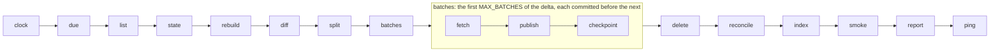

<p align="center">
  <a href="https://github.com/katoptra">
    <picture>
      <source media="(prefers-color-scheme: dark)" srcset="https://katoptra.org/brand/katoptra-mark-dark-224.png">
      
    </picture>
  </a>
</p>

<h1 align="center">nongnu</h1>

<p align="center">A mirror of Savannah's nongnu release tree, with an update twice a day.</p>

<p align="center">
  <a href="https://github.com/katoptra/nongnu/actions/workflows/sync.yml"></a>
  <a href="LICENSE"></a>
  <a href="https://github.com/katoptra/nongnu/actions/workflows/sync.yml"></a>
</p>

This mirror copies `https://download.savannah.nongnu.org/releases/` into Cloudflare R2. That
tree has the release files of the projects that Savannah hosts and that are not part of
GNU. The mirror serves each path of the tree at the root of `https://nongnu.katoptra.org/`.
It contains approximately 51,000 files and 80 GB, with a page for each directory. Twice a
day, it gets a listing of the tree from Savannah. Then it moves only the changes, and it
makes the pages again for each directory that changed.

## How to use

In a release URL, replace `https://download.savannah.nongnu.org/releases/` with
`https://nongnu.katoptra.org/`. For example,
`https://download.savannah.nongnu.org/releases/freetype/` becomes this URL:

```sh
curl -s https://nongnu.katoptra.org/freetype/
```

Upstream publishes each signature file adjacent to the file that it signs, and the mirror
does the same. To verify a file with the key of its project, use
`gpg --verify <file>.sig <file>`.

Freshness: Savannah writes its clock to `00_TIME.txt` at the root. The mirror copies this
file. The engine uploads it last, after all the other files of the tree. It uses one more
command for this file. This command shows the clock in the copy that the mirror serves:

```sh
curl -s https://nongnu.katoptra.org/00_TIME.txt
```

## How it works

Twice a day, an external scheduler starts a GitHub Actions job. The job runs this pipeline
in the toolbox image from [katoptra/lib](https://github.com/katoptra/lib). Each box is a verb
of the toolbox or of the rsync engine in lib. This mirror adds no verb.



[`Taskfile.yml`](Taskfile.yml) sets these values of the mirror:

- **The identity.** `SOURCE` is `rsync://dl.sv.gnu.org/releases/`, the module that the
  mirror page of Savannah gives. `HOST` and `BUCKET` are the domain and the bucket.
- **The limits.** If upstream is more than 120 GB (`CEILING_GB`), the run stops before it
  moves a file. If a listing does not have more than 45,000 lines (`LIST_FLOOR`), the run
  also stops. Such a short listing is not full, and the engine must not delete files
  because of it.
- **Directory pages.** `INDEX` sets the engine to make a page for each directory.
  `PAGE_FOOT` is the last line of each page. This line identifies the mirror and tells how
  frequently the mirror gets an update. It also gives an address for problem reports.
- **The canary.** `CANARY` is `00_MIRRORS.html`. This file has 17 `http://` links, and each
  HTML rewriter of Cloudflare changes such links.
- **Freshness.** `FRESH_KEY` is `00_TIME.txt`, the file in which Savannah writes its clock.
  If the time in it is more than 24 hours before the `fresh` check, the engine stops the
  run. GNU's monitor has a limit of 28 hours. Thus, the run stops before GNU's monitor finds
  the problem.

[lib's README](https://github.com/katoptra/lib#the-rsync-engine) tells how the engine uses
each of these values. It also has the only description of all the other parts, for
example:

- The list diff
- The batches
- The state file
- The daily reconcile.

## Want your own?

### 1. Fork it

1. Fork [katoptra/nongnu](https://github.com/katoptra/nongnu).
2. Change `HOST`, `BUCKET` and the address in `PAGE_FOOT` to your values.
3. Keep `SOURCE`. Savannah has no secondary mirror.

### 2. Storage

| Item | Function |
|---|---|
| An R2 bucket, or a different S3-compatible bucket | It contains the tree, its pages and their state: approximately 80 GB. On R2, the storage cost is $1.21 a month, at $0.015 for each GB-month. |
| An API token with Object Read & Write, for that bucket only | It gives the three `AWS_*` values in step 3. |
| A custom domain on the bucket. This domain is `HOST`. | Clients and the read-back checks get the files from it. |

With `/etc/aws.config` in the toolbox image, the AWS CLI sends each file of less than 4 GiB
as one PutObject ([lib, R2 specifics](https://github.com/katoptra/lib#r2-specifics)). The
largest file in the tree is 0.72 GB. [lib, Storage](https://github.com/katoptra/lib#storage)
tells how the engine uses a bucket.

### 3. Secrets

A run gets four values from one vault item, `nongnu`:

| Section | Field | Value | The run gets it as |
|---|---|---|---|
| `r2` | `access_key_id` | The token from step 2 | `AWS_ACCESS_KEY_ID` |
| `r2` | `secret_access_key` | The secret of that token | `AWS_SECRET_ACCESS_KEY` |
| `r2` | `endpoint` | `https://<account-id>.r2.cloudflarestorage.com` | `AWS_ENDPOINT_URL` |
| `healthcheck` | `url` | A healthchecks.io ping URL. This value is optional. | `HEALTHCHECK_URL` |

1. Put the UUID of your vault in the four `op://` references in [`op.env`](op.env).
2. Make a service account that can read that vault.
3. Put the token of the service account in the `OP_SERVICE_ACCOUNT_TOKEN` secret.

[lib, Secrets](https://github.com/katoptra/lib#secrets) gives more information.

### 4. The zone

The zone has three Cloudflare rules. Each rule is only for the hostname of the mirror. You
set these rules one time, out of the pipeline. The pipeline does not change them.

| Rule | Function |
|---|---|
| Configuration Rule | It sets Email Obfuscation, Rocket Loader, Automatic HTTPS Rewrites and Browser Integrity Check to off. The first three change the HTML between the bucket and the client, and the tree has approximately 4,300 HTML files. The fourth sends 403 to Perl and Python clients. If one of the four is on again, the canary check stops the run. |
| Cache Rule | Bypass. Without this rule, a client can get a previous copy of a page or of `00_TIME.txt` from the cache. |
| Transform Rule | It changes each path with `/` at the end to `concat(http.request.uri.path, http.host, ".directory.index.html")`. This includes the root. |

### 5. Do the checks, run it, schedule it

1. On a laptop with go-task, the 1Password CLI, and Docker or Apple `container`, run these
   commands:

   ```sh
   task check                # render each command of the pipeline in the image, then diff it against render.txt
   task run -- task list     # get a listing of upstream with no credentials, then read .run/upstream.txt
   ```

2. Before the first run, pause the healthcheck
   ([lib, Monitoring](https://github.com/katoptra/lib#monitoring)).
3. In Actions, select the sync workflow.
4. Select **Run workflow**.

The first run finds an empty bucket. It uses the full tree as the delta and does four
batches. Then it starts the next run, and the chain continues until the full delta is in
the bucket. The chain puts approximately 80 GB in the bucket in five or six runs. After
these runs, each run moves only the delta, usually a small number of files.

This repository does not start runs. To start runs at set times, use one of these two
methods:

- Add a `schedule:` trigger to `.github/workflows/sync.yml`, at a time that you select.
- Dispatch the workflow from an external scheduler. This mirror uses this method.

The time of the run is not important for the reconcile. In a reconcile, a run compares the
bucket with the state. A run does a reconcile if it is 23.5 hours or more since a run did
the last reconcile.

## Operating it

`task` with no task name prints the menu. Put the flags of a run after `--`. Put the same
flags in the `vars` input of the workflow:

```sh
task sync                                          # one run, the same as a run in Actions
task sync -- MAX_BATCHES=8                         # more batches in one run
task sync -- RECONCILE=true                        # a reconcile in this run: make the state again from the bucket, and delete orphans
gh workflow run sync.yml                           # one run in Actions
gh workflow run sync.yml -f vars='RECONCILE=true'  # a reconcile in this run, in Actions
```

Each run adds a table to its job page. The table shows:

- The delta, and the files that the run published
- The state
- The storage, compared with the ceiling
- The directory pages that the run made.

A run failure is the only alert. If healthchecks.io gets no ping for a slot, it sends an
e-mail. Thus, it also finds a scheduler that stopped.

[lib, When a run fails](https://github.com/katoptra/lib#when-a-run-fails) gives each verb
that can stop a run, the cause and the procedure. These items are for this mirror:

- **`split` stopped the run.** The upstream tree is more than 120 GB. The mirror gets no
  update until you increase `CEILING_GB`. This also increases the storage cost.
- **`list` stopped the run.** The listing did not have more than 45,000 lines. Start the
  run again. If it stops again, examine Savannah.
- **The canary check stopped the run.** Compare the zone with the three rules in step 4.
- **`fresh` stopped the run.** Savannah did not change `00_TIME.txt` for 24 hours. Thus,
  Savannah does not update its release area. Do not change this repository. Examine
  `dl.sv.gnu.org`.
- **The run did not start.** This repository does not start runs. Examine the scheduler
  first ([katoptra/dispatch](https://github.com/katoptra/dispatch#when-something-goes-wrong)).
  Then use `gh workflow list --all`. For the sync workflow, it shows `active`, or
  `disabled_manually` if a person disabled it. Until you find the cause, start each run with
  `gh workflow run sync.yml`.

## Reference

rsync gives the exit code 23 for each listing. In the tree, two symlinks point to no file,
and three symlinks make a loop. rsync writes a line on stderr for each of them, and it puts
all the other files in the listing. The mirror page of Savannah tells mirrors to ignore
errors of this type. Thus, the engine accepts the exit code 23.

rsync also gives the exit code 23 when it cannot read a directory. Then the engine deletes
the files of that directory until upstream lets rsync read it again
([lib, The rsync engine](https://github.com/katoptra/lib#the-rsync-engine)). `LIST_FLOOR`
stops a run if the listing decreases by more than approximately 6,000 files.

Pull requests are welcome.

MIT licensed. Built by [Josh Vaughen](https://ijosh.com).
